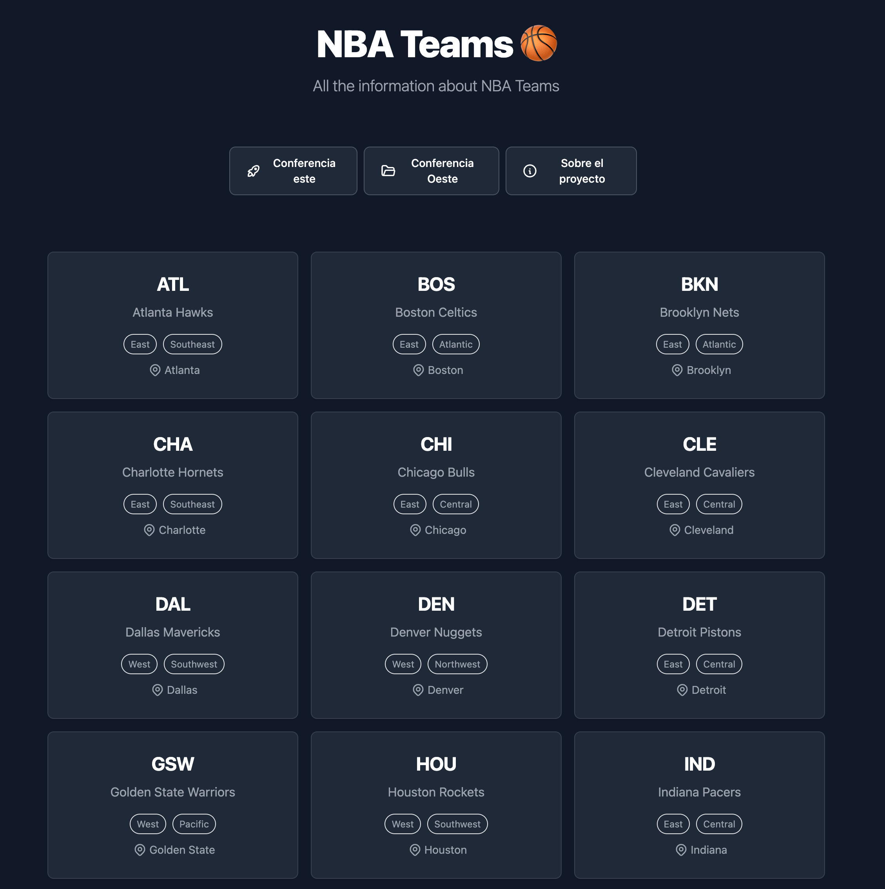

# 🪐 Astro Workshop

## 🔍 Previous considerations

Be sure to have installed Node `v18.14.1` or a newer version.

## 💻 The website

NBA teams is a small web app that shows the teams in the best basketball league
in the world. You can navigate through the teams pages and add likes to the
button in the footer 😸.

## 🧑‍🚀 Play with the code. Have fun!

Feel free to modify the code, add new functionalities and learn more about this
amazing framework.

## 🧞 Commands

All commands are run from the root of the project, from a terminal:

| Command                   | Action                                           |
| :------------------------ | :----------------------------------------------- |
| `npm install`             | Installs dependencies                            |
| `npm run dev`             | Starts local dev server at `localhost:4321`      |
| `npm run build`           | Build your production site to `./dist/`          |
| `npm run preview`         | Preview your build locally, before deploying     |
| `npm run astro ...`       | Run CLI commands like `astro add`, `astro check` |
| `npm run astro -- --help` | Get help using the Astro CLI                     |

## 👀 Want to learn more?

Here is the list of interesting links we talked about in the workshop:

- [Astro documentation](https://docs.astro.build/en/getting-started/)
- [Astro showcase](https://astro.build/showcase/) (for inspiration)
- [Astro resources](https://astro.new/latest) (like templates)
- [Astro integrations](https://astro.build/integrations/)
- [API documentation](https://www.balldontlie.io/home.html#introduction)
- [Type generator from JSON](https://app.quicktype.io/)
- [Flowbite](https://flowbite.com/) (UI framework used in the project)
- [Transitions API official docs](https://developer.mozilla.org/en-US/docs/Web/API/View_Transitions_API)
  and
  [Chrome for developers' article about Transitions API](https://developer.chrome.com/docs/web-platform/view-transitions/)

> Feel free to contact me in case you have any doubt. Thank you for your
> attention❤️
